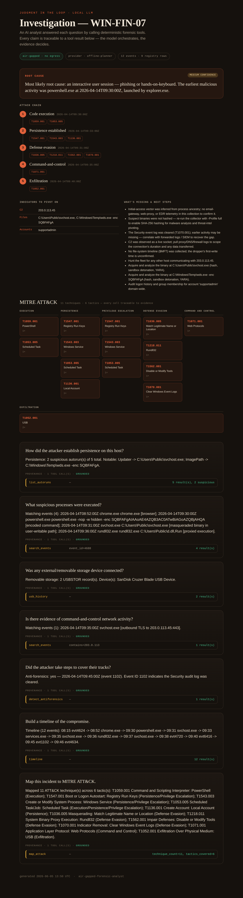
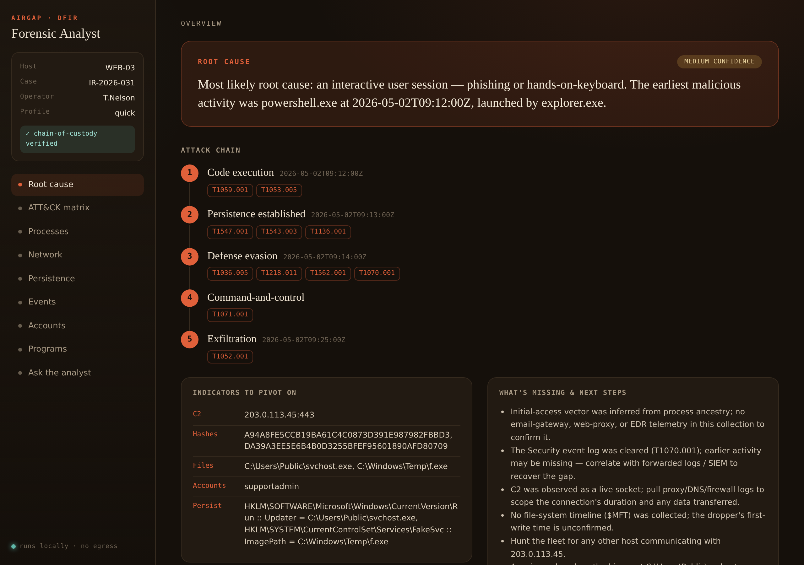
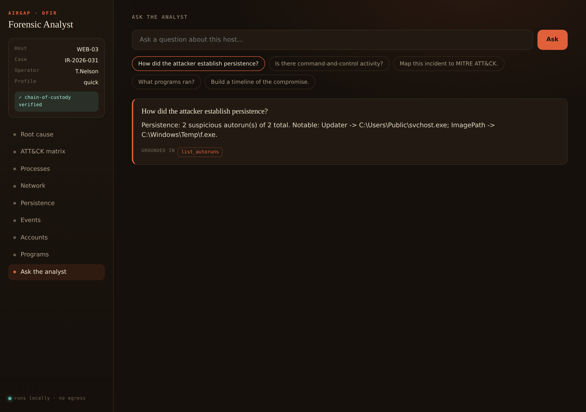
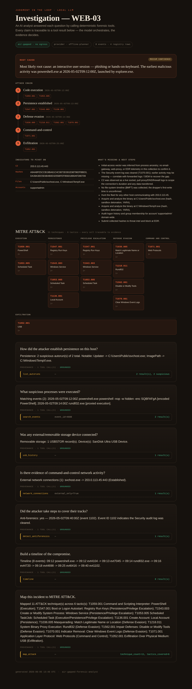
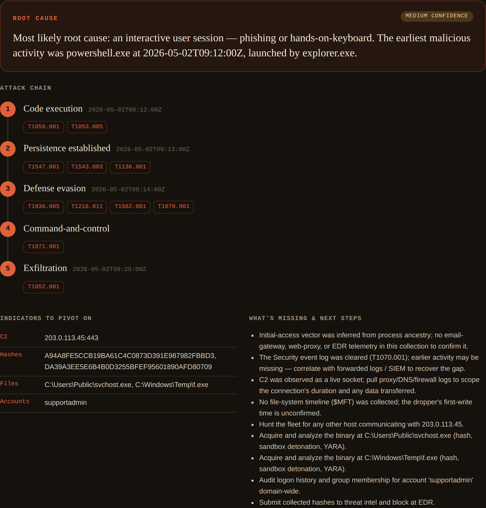
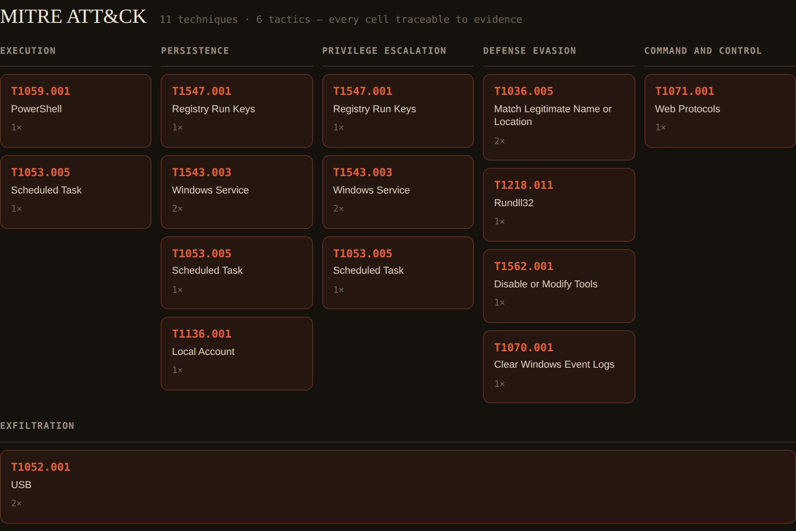

# Air-Gapped Forensic Analyst

**A local-LLM DFIR analyst that triages a live host, reconstructs the attack chain, and determines a root cause — without the evidence ever leaving the box, and without the model being allowed to make things up.**

Forensics teams want to point an LLM at their artifacts: "how did the attacker persist?", "build me a timeline", "is there evidence of this IP?". Two things stop them. First, forensic data is among the most sensitive data an organization holds — it cannot be pasted into a third-party API. Second, language models *hallucinate*, and a confident-but-wrong answer in an investigation is worse than no answer.

This tool answers both objections directly:

1. **The evidence never leaves the host.** The intended mode runs against a **local** model (via [Ollama](https://ollama.com)) on `localhost`. Egress to any remote API is blocked by default and enforced structurally — the cloud provider literally cannot be constructed unless you opt in with an environment variable and accept a printed warning.

2. **The model can't hallucinate the facts.** It doesn't read raw bytes and guess. It investigates by calling a belt of **deterministic forensic tools** (registry queries, event-log search, USB history, anti-forensics detection, cross-artifact indicator lookup). Every claim in an answer is traceable to a tool result, shown as provenance. The model orchestrates; the evidence decides.

That second point is the same spine as the rest of this portfolio: keep human-checkable ground truth under the AI, so machine speed never costs you trust.



## The interface

The whole product runs as a local web app — `afa gui` binds to `127.0.0.1`, serves a single-page console, and exposes the same deterministic engine over JSON. No build step, no external assets, no font CDN: it works on an isolated host with zero egress, which is the point. Open it and the root cause, the attack chain, the ATT&CK matrix, every artifact table, and a grounded question box are one click apart.

```bash
pip install -r requirements.txt
python -m afa.cli gui --package examples/sample-collection   # then open http://127.0.0.1:8420
```



You can ask it questions and it answers from the tools, showing exactly which ones — provenance, not vibes:



## How it collects: live triage, not disk imaging

A tool that only analyzes evidence you already exported is dead-box forensics — it doesn't scale to an incident across dozens of live hosts. So collection is a first-class stage. The product is three separable parts:

```
COLLECT                      PACKAGE                         ANALYZE
read-only live triage   ->   normalized artifacts +     ->   tools · ATT&CK · brief
(PowerShell, on host)        manifest w/ SHA-256 +           (this Python package)
fleet via WinRM              chain-of-custody
```

`collector/Invoke-AfaCollect.ps1` runs on a live Windows host (from USB, PsExec, or WinRM) and gathers the high-value triage artifacts in minutes — processes with command lines, network connections joined to owning processes, autoruns/services/scheduled-tasks, local users and admins, USB history, and recent security/system/PowerShell events. It is **strictly read-only** and **never images the disk** — this is the KAPE-targets / Velociraptor model that actually scales. It writes a **collection package**: normalized artifact files plus a `manifest.json` carrying chain-of-custody (case id, operator, host, collector version, time) and a SHA-256 for every file. For a fleet, `-ComputerName host1,host2` fans the same collection out over WinRM.

```powershell
# one host, fast triage profile
.\collector\Invoke-AfaCollect.ps1 -Profile quick -Operator "T.Nelson" -CaseId IR-2026-014
# a fleet, over WinRM
.\collector\Invoke-AfaCollect.ps1 -ComputerName web-01,db-02 -CaseId IR-2026-014
```

Then verify custody and analyze — the analyzer refuses to touch a package whose hashes don't match the manifest:

```bash
python -m afa.cli verify  examples/sample-collection      # chain-of-custody + integrity
python -m afa.cli attack  --package examples/sample-collection
python -m afa.cli brief   --package examples/sample-collection
python -m afa.cli report  --package examples/sample-collection --out case.html
```

A worked package (a live-triaged host, `WEB-03`) ships in `examples/sample-collection/`, so the whole collect → verify → analyze flow runs end-to-end with no endpoint. The ATT&CK mapper draws on the live process and network artifacts too — e.g. C2 is detected from an established connection to a public IP, and masquerading from a process running out of `C:\Users\Public`.



## Root-cause analysis

Collecting artifacts is table stakes; the job is figuring out *what happened*. Given a package, the analyst reconstructs the attack chain and **determines the most likely root cause** — with a stated confidence and an honest list of what's missing. The reasoning is rule-based correlation over the deterministic tools (process ancestry, timeline, ATT&CK, network, accounts), so every conclusion traces back to a collected artifact.

```bash
python -m afa.cli rootcause --package examples/sample-collection
```

It infers the initial-access vector from process ancestry (e.g. `powershell.exe` spawned by `explorer.exe` → interactive session, likely phishing or hands-on-keyboard — *medium* confidence, because no email/proxy telemetry was in the collection to confirm it), lays out the kill-chain phase by phase, extracts the IOCs an investigator pivots on (C2, hashes, dropped binaries, attacker accounts), and states the gaps that would raise confidence ($MFT timeline, proxy logs, the cleared event log). It is deliberately not overconfident — naming a root cause it can't fully support would be the exact failure this project exists to prevent.



## MITRE ATT&CK mapping

The agent doesn't just answer questions — it maps the whole incident to MITRE ATT&CK, deterministically and with provenance. Each technique is detected by a rule that returns the concrete evidence supporting it, so nothing is asserted without a trail back to an event or registry row. This runs with no model at all:

```bash
python -m afa.cli attack                       # prints the technique table
python -m afa.cli attack --out attack.html      # ATT&CK matrix as HTML
```

On the bundled case it surfaces 11 techniques across 6 tactics — PowerShell execution, Run-key and service persistence, scheduled-task and local-account creation, masquerading, rundll32 proxying, Defender tampering, log clearing, web-protocol C2, and USB exfiltration:



## Quickstart (zero setup, no model, no network)

```bash
pip install -r requirements.txt
python -m afa.cli ask "How did the attacker establish persistence?"
python -m afa.cli report --out report.html        # full HTML investigation
```

Out of the box it runs the **offline planner** — a deterministic intent router over the same tools. No model, no egress, fully reproducible. It's how you demo the architecture and the provenance without installing anything.

## Run it the real way — a local model

Install Ollama and pull a tool-capable model, then point the agent at it:

```bash
ollama pull llama3.1
python -m afa.cli repl --mode local --model llama3.1
```

Now a real model plans the investigation, calls the tools through Ollama's tool-calling API, and composes answers from what they return — all on `localhost`. Nothing about the case touches the network. The agent loop itself is unit-tested with a scripted model, so the orchestration (tool dispatch, multi-step reasoning, grounded assembly) is verified independently of any particular model's behavior.

It can also write the brief for you. `python -m afa.cli brief --mode local` hands the grounded findings to the local model and asks for an executive incident summary — prose, but built only from facts the tools produced.

## Run on your own evidence

The bundled artifacts use a tidy internal schema, but real analysts arrive with whatever their tooling produced. Point the analyst at your own exports and it normalizes them automatically:

```bash
# Windows events from PowerShell, plus a registry export
python -m afa.cli attack \
  --events  events.json   \   # Get-WinEvent | ConvertTo-Json, CSV, or JSONL
  --registry hive.reg          # reg export (.reg) or JSON
```

Supported on ingest: `Get-WinEvent ... | ConvertTo-Json` output, flexible CSV (Sysmon/SIEM column names), native JSON/JSONL for events; `.reg` text exports or JSON for the registry. Worked examples live in `examples/sample-exports/`. The normalizer maps process names, command lines, timestamps (including PowerShell's `/Date(...)/`), and registry categories into the schema the tools expect.

## The three modes

| Mode | Driver | Egress | Use |
| --- | --- | --- | --- |
| `offline` (default) | deterministic planner | none | zero-setup demo; reproducible CI |
| `local` | local model via Ollama | none (loopback only) | the intended production mode |
| `cloud` | a remote API | **refused unless `AFA_ALLOW_EGRESS=1`** | only for data you're cleared to share |

The air-gap is not a README promise — it's a guard:

```python
# afa/egress.py — remote URLs raise unless egress is explicitly enabled
assert_local("https://api.anthropic.com/v1/messages")  # -> EgressBlocked
```

## How it works

```
collector/        Invoke-AfaCollect.ps1 — read-only live triage collector (Windows)
afa/package.py    load collection packages + verify chain-of-custody (SHA-256)
afa/rootcause.py  attack-chain reconstruction + root-cause determination + IOCs
afa/gui.py        local FastAPI web console (127.0.0.1, no egress) + static/ SPA
artifacts/        synthetic Windows evidence: registry.json + events.jsonl
afa/tools.py      the forensic tool belt — the deterministic oracle the agent must use
afa/normalize.py  ingest real exports (Get-WinEvent JSON, CSV, .reg) into the schema
afa/providers.py  offline planner · local Ollama agent loop · gated cloud provider
afa/brief.py      a grounded executive incident brief (deterministic, or model-written)
afa/egress.py     the air-gap guard (loopback allowed; remote opt-in + warned)
afa/report.py     terminal output + a standalone HTML investigation report
afa/cli.py        ask · repl · report · attack · brief · rootcause · verify · gui · tools
```

The tools are the substance. They're plain functions over the parsed evidence — `list_autoruns`, `search_events`, `usb_history`, `detect_antiforensics`, `find_indicator`, `timeline`, `process_tree`, `scheduled_tasks`, `account_changes`, `running_processes`, `network_connections`, `local_users`, `program_execution`, `powershell_activity`, and `map_attack` — and they're exposed to the model through the standard tool-calling schema.

## Extending it

Add a tool by writing one deterministic function in `afa/tools.py` and registering it. Add an ATT&CK rule by appending to `ATTACK_RULES` with a matcher that returns its evidence. If you can't write a deterministic resolver for a question, that's a signal it's an analyst judgment call — not something to let the model assert.

## Tests

```bash
pip install -r requirements-dev.txt
pytest -q
```

The suite proves the tools find the real persistence, USB, C2, scheduled-task, account, and anti-forensic artifacts (and stay quiet on absent indicators); that every mapped ATT&CK technique is backed by evidence; that the ingest layer normalizes Get-WinEvent JSON, CSV, and `.reg` exports correctly; that a collection package loads and that tampering with any file fails the custody check (and blocks analysis); that root-cause analysis reconstructs the kill-chain in order, extracts the right IOCs, and stays at the correct confidence (including dropping to low when no malicious activity is present); that the agent loop chains tools and assembles a grounded answer when driven by a scripted model; that the egress guard blocks remote URLs by default and allows them only on opt-in; and that a full offline investigation is grounded — every answer built from at least one tool call.

## What this is and isn't

It **is** a working pattern for private, on-host AI-assisted DFIR with provenance, a structural air-gap, and a real collect → verify → analyze pipeline. It does **live triage collection** of high-value volatile and persistence artifacts — deliberately *not* full disk imaging, which is the slow dead-box approach that doesn't scale.

Two honesty notes. The collector (`Invoke-AfaCollect.ps1`) is written to spec for a live Windows host and run there; the Python analysis pipeline — ingest, custody verification, the tools, ATT&CK mapping, the agent-loop orchestration, and the brief — is exercised end-to-end in CI, including against the sample collection package. And it is not a full forensic suite: the bundled artifacts are synthetic (all addresses are RFC 5737 documentation ranges). The artifact set is intentionally triage-focused; deeper sources ($MFT, Amcache/Shimcache, prefetch, browser, WMI persistence) are natural next collectors to add — each is one normalizer plus one tool.

## License

MIT — see [LICENSE](LICENSE).
